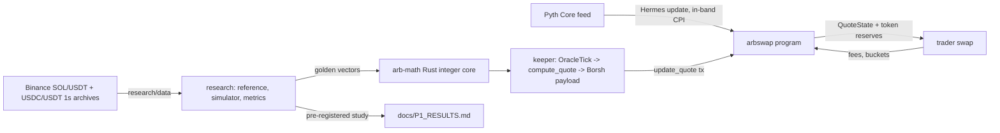

# ArbSwap Architecture

Derived from the code in this repository (program, keeper, research), not from a
diagram. Every claim below cites the file that implements it. The language split
between Python research and Rust production is in
[`LANGUAGE_ARCHITECTURE.md`](LANGUAGE_ARCHITECTURE.md); the math is in
[`FORMULA.md`](FORMULA.md).

> The original design diagram (`TruQuote_Architecture_Final.png`/`.pdf`) is not
> present in this repository. `docs/architecture/` does not exist. If the final
> diagram is added, it belongs there and should be embedded in this file. The
> component map below is the agreed replacement until then.

## 1. Components

| Component | Path | Language | Role | Status |
|---|---|---|---|---|
| On-chain program | `programs/arbswap/` | Rust (Anchor) | Custody, quote storage, swap walk, guards, breakers | builds + LiteSVM lifecycle passes |
| Shared math core | `crates/arb-math/` | Rust (no deps) | Q64.64 primitives, ladder walk, fees, shares, rounding | unit + property + 970 golden vectors |
| Keeper | `keeper/` | Rust | oracle tick → quote → Borsh `update_quote` payload → sender | deterministic replay/dry-run; live RPC Open |
| Research reference | `research/reference/` | Python | independent float reference + golden-vector generator | implemented |
| Simulator + studies | `research/sim/` | Python | venue comparison, pre-registered W1–W6 study, metrics | Task 1 complete |
| Data scripts | `research/data/` | Python | Binance archive download and normalisation | implemented |
| Analytics | `analytics/` | — | indexer, markouts, LVR, gap metrics | **not started (P4)** |
| Dashboard | `app/` | Next.js | LP / trader / risk / demo views | scaffold only |
| Attacker bots | `attackers/` | — | adversarial bots (E7) | **not started (P5)** |

## 2. Pipeline



The bridge between research and production is the golden vectors
(`research/reference/golden.py` → `crates/arb-math/tests/golden_vectors.txt`).
The bridge between keeper and program is the byte-exact `update_quote` payload
(`keeper/src/lib.rs::encode_update_quote_instruction`).

## 3. On-chain data model (`programs/arbswap/src/lib.rs`)

PDAs (seeds from the Anchor account constraints):

| Account | Seeds | Holds |
|---|---|---|
| `Vault` | `vault`, base mint, quote mint | admin, mints, reserve/share accounts, `total_shares`, fee buckets, epoch, `status` (`ACTIVE`/`WIND_DOWN`), bump |
| `Config` | `config`, vault | keeper pubkey, Pyth feed id, fee split, warmup/epoch/grace/expiry slots, oracle limits (`max_staleness_seconds`, `max_conf_bps`, `max_anchor_step_bps`), `max_spread_bps`, `max_quote_size`, `max_inventory_bps` |
| `QuoteState` | `quote`, vault | `version`, `update_slot`, `expiry_slot`, anchor/reservation sqrt prices, spread + directional + depth bps, `flow_n`, oracle publish time/conf, six ladder `levels` |
| `DepositTicket` | per `(vault, user)` | shares, warmup `activate_slot` |
| `WithdrawTicket` | per `(vault, user)` | queued shares, epoch |

`LEVELS = 6`; offsets `[2,5,10,20,40,80]` bps and weights
`[1000,1500,2000,2000,2000,1500]` (see `FORMULA.md` §6.1 / §15.1). Shares
exclude the insurance/keeper/protocol buckets.

## 4. Instruction surface

| Instruction | Guard rails (code) |
|---|---|
| `initialize_vault` | creates vault/config/quote PDAs, mints, reserves, share mint + lock |
| `deposit` | `ACTIVE`; first deposit mints `sqrt(dB*dQ) - min_liquidity` and burns the lock, later deposits mint `min(dB*S/B, dQ*S/Q)`; both legs are transferred and the imbalanced leg is **not refunded** (audit F-10) |
| `request_withdraw` | requires warmup elapsed; queues shares on the ticket |
| `crank_epoch` | advances the withdrawal epoch |
| `claim_withdraw` | pays pro-rata from reserves net of buckets |
| `update_quote` | keeper authority; monotone slot `stored < update_slot <= clock.slot`; Pyth `PriceUpdateV2` Full verification + feed id + freshness; decoded Q64 price and confidence must equal the payload; `half_spread_bps <= max_spread_bps`; anchor step bound; ladder shape |
| `swap` | quote not expired; `amount_in <= max_quote_size`; fee; `walk_ladder`; `remaining == 0`; `out >= min_out`; `min_version <= quote.version`; fee split into buckets |
| `trip_breaker` | public; only trips from stored quote expiry |
| `reset_breaker` | clears the breaker after recovery |
| `wind_down` | admin-only; sets `status = WIND_DOWN`, after which `update_quote` is `Paused` |

## 5. Off-chain keeper (`keeper/`)

```text
OracleTick (slot, publish_time, price_q64, confidence_bps)
   -> VolatilityState::update            (EWMA, jump flag)
   -> compute_quote                      (inventory skew, reservation, spread,
                                          directional add-on, depth throttle, ladder)
   -> should_update                      (price-move / staleness gate)
   -> priority_fee_lamports              (urgency from sigma, doubles on jump)
   -> encode_update_quote_instruction    (byte-exact Anchor payload)
   -> QuoteSender                         (DryRunSender today; live RPC is Open)
```

`compute_quote` values the base reserve in quote atoms
(`base * price_q64 / 2^64 / base_atom_scale`), so a SOL(9)/USDC(6) vault is not
skewed by decimals (`ASSUMPTIONS` A-18, audit F-03). The replay path is
deterministic (`keeper replay <csv>`); the `single` command exposes one quote for
differential testing against `research/sim/test_keeper_parity.py`.

## 6. Trust boundaries

- **Trader** is untrusted: `min_out`, `min_version`, checked arithmetic.
- **Keeper** is bound by on-chain guards, but the executed `levels` are checked
  for shape only, not bound to the anchor/oracle — a compromised keeper can
  quote arbitrary prices (audit **F-04**, open, top devnet blocker).
- **Pyth** is trusted at `VerificationLevel::Full`; the account owner is the
  Pyth Receiver program (enforced by `Account<PriceUpdateV2>`).
- **Admin** can wind down; there is no timelocked `set_params` yet (F-17).

## 7. Compute budget (measured, LiteSVM)

| Instruction | CU |
|---|---|
| `update_quote` | 12,802 |
| `trip_breaker` | 7,051 |
| `swap` | 33,676 |

Every instruction fits the 200,000 CU default. `swap` fell 6× after the
`arb-math` division/sqrt rewrite (`ASSUMPTIONS` A-17). Pyth verification CU is
in-band and caller-paid, so it is reported separately from ArbSwap's part.

## 8. Reproducibility

| Artefact | Command |
|---|---|
| Golden vectors | `python -m research.reference.golden` then `cargo test -p arb-math` |
| Held-out study | `python -m research.sim.study {calibrate,evaluate,studies,render}` |
| Report | `docs/P1_RESULTS.md` (pre-registered) / `docs/P1_SYNTHETIC.md` (exploratory) |

## 9. Known gaps (see `docs/AUDIT_REPORT.md` for the full register)

- **F-04** executed levels not bound to the anchor — Open, blocks devnet.
- Live RPC/private-key keeper transport — Open (the only Open security row
  besides F-04).
- Keeper EWMA time-normalisation and ask-only ladder — documented divergence.
- LVR depth *budget* not wired (`R`, `g_gas` undefined) — F-08.
- Deposit over-pull and single-use tickets — F-10; no virtual shares — F-11.
- `analytics/` and `attackers/` are P4/P5 and unstarted.
